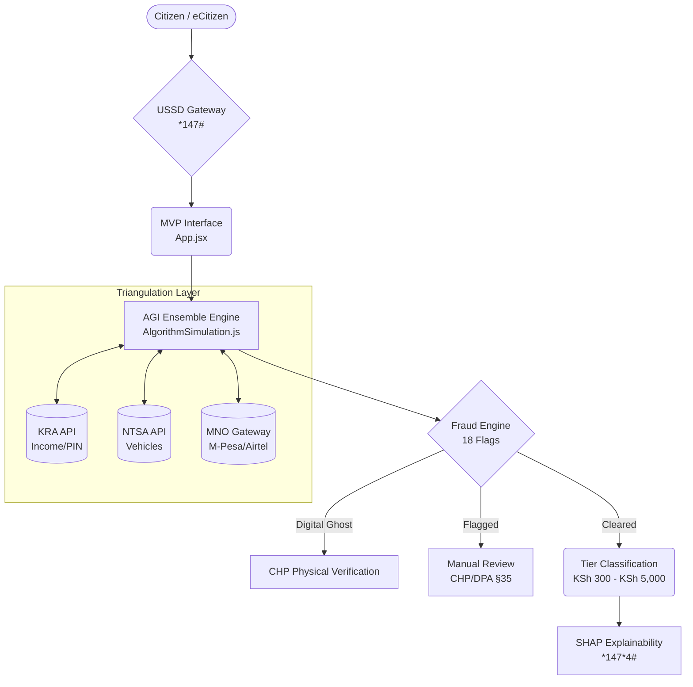

# SHA PMT v2.1 — Fixing Kenya's Health Insurance Algorithm

**Social Health Authority (SHA) Means-Testing Algorithm Reform**

An evidence-based proposal to replace Kenya's biased Lasso PMT algorithm with a transparent, constitutionally compliant Adjusted Gross Income (AGI) model.

---

## The Problem

Kenya's Social Health Authority deployed a Proxy Means Test (PMT) algorithm that:
- **Overpredicts income** for 80% of the poorest households
- Has a **56% exclusion error** for poor households with basic electricity
- Has a **65% exclusion error** for poor female-headed households (vs 34% for male-headed)
- Was flagged as inequitable by IDinsight **before deployment** — and deployed regardless

The High Court (March 2026) rebuked SHA for a 'chaotic and premature' rollout that denied critical medical services — including cancer treatment and dialysis — and issued a structural interdict requiring corrective measures under judicial supervision. The CAJ ordered full algorithm disclosure.

### The "Error by Design" Crisis (May 2026)

The *Africa Uncensored* investigative documentary **"Error by Design"** (co-published with *Lighthouse Reports* and *The Guardian*) proved that:
- The PMT algorithm's rural sub-model has an R² of just **0.46** vs 0.66 for urban — rural households are systematically misclassified
- **80% of the poorest households** have their consumption overpredicted, leading to unaffordable premiums
- Female-headed households are disproportionately misclassified as non-poor
- International consultants warned the algorithm was "inequitable" and "unfixable" **before deployment** — the government proceeded regardless
- Critically ill patients have been **denied treatment at hospitals** because they cannot afford the algorithmic premium

The AGI model directly addresses every flaw exposed in the documentary.

## The Solution — AGI Model (v2.1)

The AGI model applies **7 evidence-based deductions** before the legally mandated 2.75% rate, adjusting the tax base rather than the rate:

| Deduction | Description |
|---|---|
| ASAL Land Discount | 85% reduction for arid/semi-arid land valuations |
| Dependency Allowance | 8% per dependent, capped at 35–40% |
| CHE Exemption | Catastrophic health expenditure protection |
| Digital Debt Exclusion | Fuliza/M-Shwari defaults deducted |
| Household Expense Float | Cost-of-living adjustment by county |
| Tools of Trade | Income-generating assets depreciated, not penalized |
| Fiduciary Exemption | Chama/group funds excluded from personal income |

**Revenue projection:** At 60% target compliance (based on Rwanda CBHI benchmark) with 15.5M eligible population and KSh 575 average contribution, projected annual revenue is **KSh 64B** — compared to the current system's KSh 90B collected from only 22.7% compliance. Fair premiums increase total collection by driving mass voluntary compliance.

## Repository Structure

```
├── docs/                        # Policy, legal & technical documentation
│   ├── EXECUTIVE_SUMMARY_ONE_PAGER.docx
│   ├── Algorithm_Documentation.docx
│   ├── AI_BILL_2026_COMPLIANCE.docx
│   ├── LEGAL_ETHICAL_ARCHITECTURAL_EVALUATION.docx
│   ├── CAJ_21_DAY_DISCLOSURE.docx
│   ├── PRIVACY_POLICY.docx
│   ├── KIPPRA_SUBMISSION_LETTER.docx
│   └── ... (full document set)
│
├── sha-mvp/                     # Interactive web MVP (Vite + TypeScript)
│   ├── src/
│   ├── public/
│   ├── index.html
│   └── package.json
│
├── SHA_Financial_Model.xlsx     # Revenue & compliance projections
├── SHA_Impact_Summary.xlsx      # Impact metrics
└── IMPLEMENTATION_ROADMAP.xlsx  # Phased rollout timeline
```

## Legal Framework

| Legal Instrument | Requirement | v2.1 Status |
|---|---|---|
| Constitution Art. 27(4) | No sex/geography discrimination | ✅ Compliant |
| DPA 2019 §32/35/39 | Consent, human oversight, retention | ✅ Compliant |
| AI Bill 2026 | Impact assessment, bias testing, explainability | ✅ Compliant |
| CAJ Order | Algorithm disclosure | ✅ Submitted |
| High Court (Mwita, 2025) | No double taxation on gross income | ✅ Resolved |
| High Court (Mwamuye, 2026) | Fix means-testing infrastructure | ✅ Addressed |

## Key Documents

- **Executive Summary** — One-page overview for decision-makers
- **Algorithm Documentation** — Full technical specification with formulae
- **AI Bill 2026 Compliance** — Regulatory compliance framework
- **CAJ 21-Day Disclosure** — Algorithm disclosure filed with the Commission on Administrative Justice
- **SHAP Deduction Receipts** — Citizen-facing explainability framework
- **Privacy Policy** — DPA 2019 compliant data protection policy

## Running the MVP

**🌍 [Try the Live Interactive Demo Here](https://pmkaulani.github.io/sha-pmt-reform/)**

Or run it locally:
```bash
cd sha-mvp
npm install
npm run dev
```

## Fraud Detection

Kenya lost **KSh 11 billion** to ghost patients, fake facilities, and upcoding in just 6 months (Oct 2024 – Apr 2025). Over 1,000 facilities were closed and 30 prosecutions are underway. The AGI model includes an **18-flag fraud detection engine** that catches phantom dependents, hidden high-value assets (NTSA cross-check), formal vs business income under-reporting (KRA PIN Type cross-check), and geographic impossibility — addressing the systemic vulnerabilities that enabled the fraud.

## Provider Payments

This reform addresses the **contribution** side of the SHA equation (how much citizens pay). The **reimbursement** side (how quickly hospitals are paid) is out of scope for algorithm reform, but accurate means-testing directly improves fund solvency, which enables faster and more predictable provider payments.

## International Comparison

SHA's official defense cited Colombia's Sisben and Indonesia's DTKS as validation for PMT. However:
- **Colombia's Sisben IV** features continuous updates, three separate sub-index modules, and annual recalibration — Kenya's PMT has none of these
- **Indonesia's DTKS** includes annual updates and a village-forum community verification layer — Kenya's PMT has no community verification

The AGI model integrates the missing components from both systems: continuous retraining (via KIHBS 2025/26), multi-layer verification (Triangulation), and community-level fallback (CHP protocol).

## MNO-Agnostic Architecture & Fallback Protocol

While Safaricom (M-Pesa) holds significant market share, the Triangulation engine is explicitly designed as an **MNO-agnostic gateway**. To comply with the Communications Authority of Kenya's data portability mandates, the system integrates via an aggregation layer that supports Safaricom, Airtel, and Telkom equally. 

**KRA PIN Type Granularity:**
The triangulation engine also uses granular KRA API data (`kraPinType`) to differentiate between active formal payroll employees (`PAYE`) and self-declared business owners (`BUSINESS`). This allows the algorithm to apply mathematically higher confidence weighting to formal payroll mismatches.

**Disaster Recovery (Triangulation Fallback):**
To ensure the system remains mathematically sound during API outages (KRA, NTSA, or MNO gateway failures), or when assessing citizens who operate purely in cash (zero digital footprint), the system features a built-in **Fallback Protocol**:
1. **Secondary Proxy Layer:** The algorithm automatically shifts its weighting entirely to verifiable physical capital (Land, Livestock, Commercial Vehicles, Major Appliances) while retaining demographic protections.
2. **Digital Ghost Protocol:** If a citizen claims indigence but has absolutely zero digital footprint and zero physical assets, they are flagged as a "Digital Ghost". They are granted a provisional KSh 300 subsidy but automatically routed for **mandatory physical verification by a Community Health Promoter (CHP)** within 90 days, mimicking Indonesia's DTKS validation layer and preventing cash-based tax evasion.

### System Architecture



## Author

**Peter M. Kaulani**
KCA University | 2507765@students.kcau.ac.ke

---

*This project responds to the High Court's March 19, 2026 structural interdict requiring corrective measures, the CAJ Order #CAJ/2026/05/0847, and the pending Awino petition transferred to the Constitutional and Human Rights Division at Milimani.*
